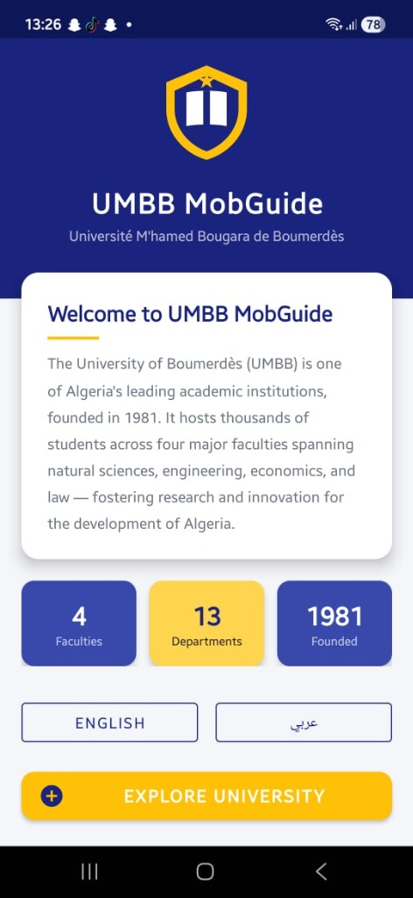
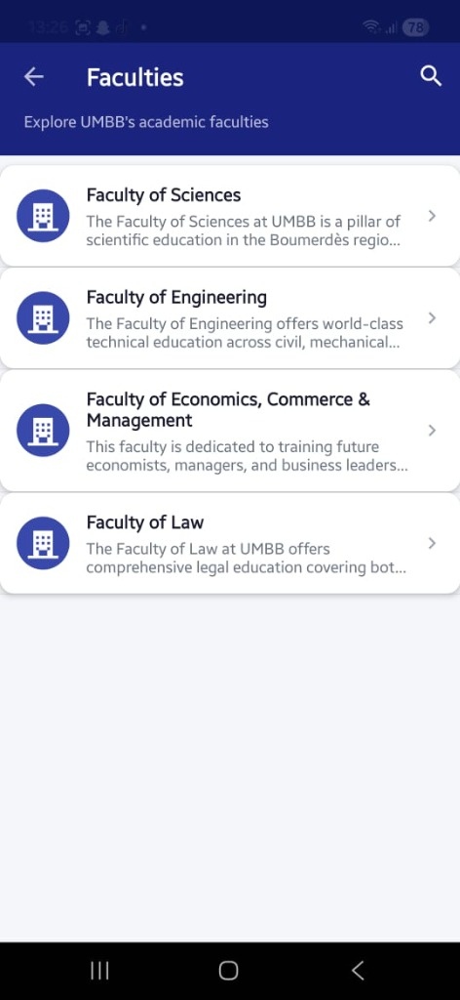
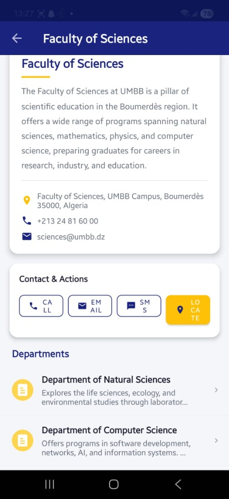
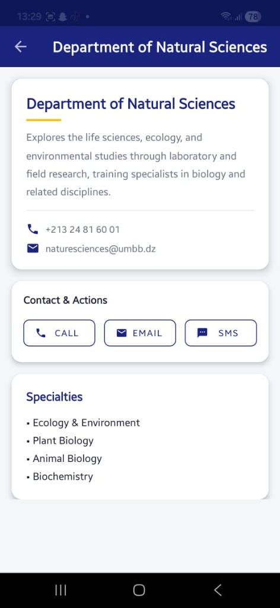
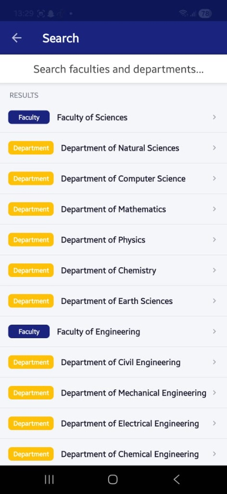

# UMBB MobGuide 🎓📱

Welcome to the **UMBB MobGuide**, the official mobile directory and university guide for the **Université M'hamed Bougara de Boumerdès (UMBB)**. 

This Android application provides students, staff, and visitors with a centralized platform to explore the university's faculties, departments, and academic specialities, complete with seamless contact options and multilingual support.

---

## ✨ Features

- 🏛️ **Faculty & Department Directory**: Browse through all 4 major faculties and 13+ academic departments natively within the app.
- 🌍 **Multilingual Support**: Fully localized in both **English** and **Arabic**, accessible directly from the welcome screen.
- 🔍 **Global Search**: Find specific faculties and departments instantly with an optimized search interface.
- 📞 **One-Tap Contact Actions**: 
  - Call departments directly.
  - Send templated emails for inquiries.
  - Send SMS messages.
  - Locate faculties on Google Maps.
- 🎨 **Modern UI/UX**: Built using Material Design guidelines with a sleek, responsive, and accessible interface.

---

## 🛠️ Technology Stack

- **Platform**: Android (Min SDK 21, Target SDK 34)
- **Language**: Java
- **UI Framework**: XML, AndroidX, Material Design Components
- **Architecture**: Classic MVC architecture with static `DataProvider` models for fast offline access.

---

## 🚀 Getting Started

### Prerequisites
- [Android Studio](https://developer.android.com/studio) (latest version recommended)
- Android SDK 34
- A physical Android device or emulator running API 21+

### Installation
1. Clone the repository:
   ```bash
   git clone https://github.com/nabilmansour16/App-Mobile-University-guide.git
   ```
2. Open the project in **Android Studio**.
3. Sync the project with Gradle files.
4. Click **Run** (`Shift + F10`) to build and deploy the app to your emulator or device.

---

## 📸 Screenshots

| Welcome Screen | Faculties List | Faculty Details |
|:---:|:---:|:---:|
|  |  |  |

| Department Details | Search Functionality |
|:---:|:---:|
|  |  |

---

## 🤝 Contributing

Contributions, issues, and feature requests are welcome! 
If you are a student or developer who wants to improve the UMBB MobGuide:
1. Fork the project.
2. Create your feature branch (`git checkout -b feature/AmazingFeature`).
3. Commit your changes (`git commit -m 'Add some AmazingFeature'`).
4. Push to the branch (`git push origin feature/AmazingFeature`).
5. Open a Pull Request.

---

## 📄 License

This project is open-source and available for educational and non-commercial purposes. 

**Developed with ❤️ for the UMBB Community.**